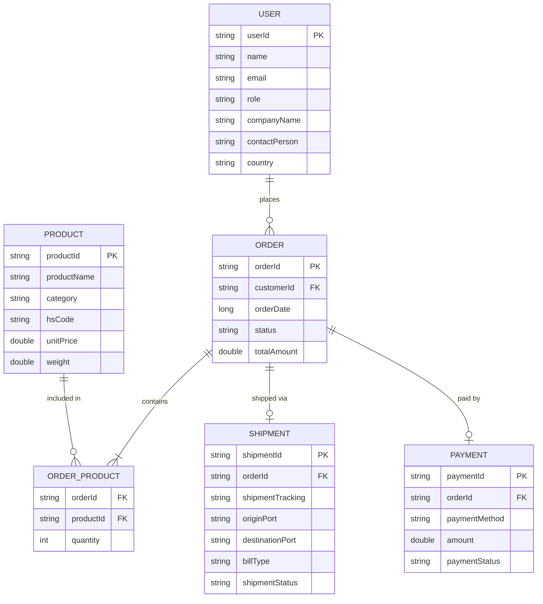

# 🚢 Taahsile — Import/Export Management App

<p align="center">
  <strong>A professional B2B Android application for managing international trade workflows.</strong>
</p>

<p align="center">
  
  
  
  
  
</p>

---

## 📋 Overview

**Taahsile** is a native Android application built for businesses involved in international import-export operations. It streamlines the entire trade lifecycle — from managing product catalogs and placing orders to tracking shipments across ports and monitoring payment statuses.

### Who is it for?
- **Import/Export business owners** — Full visibility into operations
- **Staff members** — Day-to-day order and shipment management
- **Customers** — Track orders and payments in real-time

---

## ✨ Features

### 🔐 Authentication & Onboarding
- Role-based login (Admin / Staff / Customer)
- Business profile setup (Company Name, Contact Person, Country)
- Secure email + password authentication

### 📦 Digital Product Catalog
- Searchable inventory by **product name**, **HS Code**, or **category**
- Product cards showing unit price, weight, and trade classification
- Grid layout with Material 3 Bento-style cards

### 🛒 Order Workflow
- Shopping cart with quantity controls (+/−)
- Real-time total amount calculation
- Order placement linked to specific customers
- Order history with status badges (Pending, Processing, Completed)

### 🚚 Logistics Tracker
- Interactive shipment tracking with **visual timeline**
- Expandable cards showing journey from Origin Port → Destination Port
- Status progression: Booked → In Transit → Customs → Delivered
- Bill of Lading type display

### 💰 Financial Dashboard
- Summary cards for **Pending** and **Paid** amounts
- Transaction history with payment method details
- Status badges for each payment (Pending / Paid)

### 📄 Trade Documents
- Bill of Lading viewer
- Customs Declaration documents
- Commercial Invoices & Packing Lists
- Certificate of Origin
- Download functionality for offline access

### 📡 Offline Mode
- Room database caches all data locally
- App remains functional without internet connectivity
- Auto-syncs when connection is restored

---

## 🏗️ Architecture

```
com.example.taahsil/
├── data/
│   ├── local/
│   │   ├── dao/          # Room DAOs (User, Product, Order, Shipment, Payment)
│   │   ├── entity/       # Room Entities
│   │   └── AppDatabase.kt
│   ├── remote/
│   │   └── TaahsilApi.kt # Retrofit API interface
│   └── repository/       # Repository layer (offline-first)
├── di/                   # Hilt modules (Database, Network)
├── ui/
│   ├── auth/             # Login & Signup screens + ViewModel
│   ├── components/       # Reusable UI (BentoCard, StatusBadge, Timeline, etc.)
│   ├── dashboard/        # Bento grid dashboard
│   ├── documents/        # Trade document viewer
│   ├── navigation/       # NavGraph routing
│   ├── orders/           # Order management + cart
│   ├── payments/         # Financial summary
│   ├── products/         # Product catalog
│   ├── shipments/        # Shipment tracking
│   └── theme/            # Deep Enterprise theme (Color, Type, Shape)
├── MainActivity.kt       # @AndroidEntryPoint with Compose
└── TaahsilApplication.kt # @HiltAndroidApp
```

**Pattern:** MVVM + Repository + Offline-First Caching

---

## 🎨 Design System

| Element | Value | Purpose |
|---------|-------|---------|
| Primary | `#0F172A` | Deep Navy backgrounds |
| Accent | `#38BDF8` | Electric Blue buttons & active states |
| Success | `#10B981` | Emerald for "Paid" status |
| Surface | `#F8FAFC` | Off-White card backgrounds |
| Border | `#E2E8F0` | Subtle Bento dividers |

- **Headings:** Plus Jakarta Sans (Semi-Bold/Bold, 20-24sp)
- **Body/Data:** Inter (Regular/Medium, 14-16sp)
- **Labels:** Inter Medium (12sp)
- **Cards:** 16-24dp rounded corners (Bento Box style)
- **Nav Bar:** Glassmorphism (translucent + blur)
- **Status:** Pill badges with low-opacity backgrounds

---

## 🛠️ Tech Stack

| Technology | Version | Purpose |
|-----------|---------|---------|
| Kotlin | 1.9.23 | Primary language |
| Jetpack Compose | BOM 2024.03 | UI framework |
| Material 3 | Latest | Design system |
| Room | 2.6.1 | Local database |
| Retrofit 2 | 2.11.0 | REST API client |
| Dagger Hilt | 2.51 | Dependency Injection |
| Navigation Compose | 2.7.7 | Screen routing |
| Coroutines | 1.8.0 | Async operations |
| Google Fonts | 1.6.3 | Plus Jakarta Sans & Inter |

---

## 🚀 Getting Started

### Prerequisites
- **Android Studio** Hedgehog (2023.1.1) or later
- **JDK 17** (configured automatically via `gradle.properties`)
- **Min SDK 24** (Android 7.0 Nougat)

### Setup
1. Clone the repository:
   ```bash
   git clone https://github.com/yourusername/Taahsil.git
   ```
2. Open in **Android Studio**
3. Let Gradle sync complete
4. Run on an emulator or physical device

### Backend Configuration (Optional)
The app works **fully offline** out of the box using Room database. To connect to a backend API:

1. Open `app/src/main/java/com/example/taahsil/di/NetworkModule.kt`
2. Replace the placeholder URL:
   ```kotlin
   .baseUrl("https://api.taahsile.com/") // ← Replace with your backend URL
   ```
3. Your backend should implement the endpoints defined in `TaahsilApi.kt`:
   - `POST /auth/login` & `POST /auth/register`
   - `GET /products` & `GET /products/search`
   - `POST /orders` & `GET /orders`
   - `GET /shipments/{orderId}`
   - `GET /payments/pending`

---

## 📊 Database Schema



---

## 📝 License

This project is for educational and business purposes.

---

<p align="center">
  Built with ❤️ by Anabia using Kotlin & Jetpack Compose
</p>
